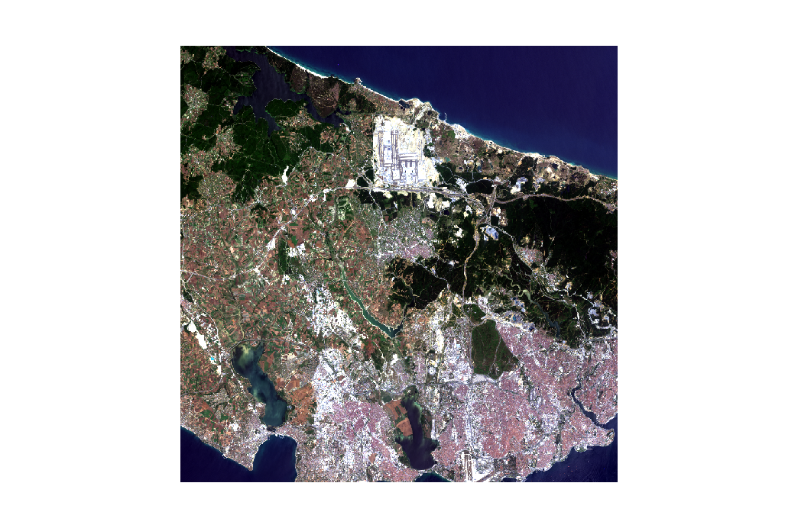
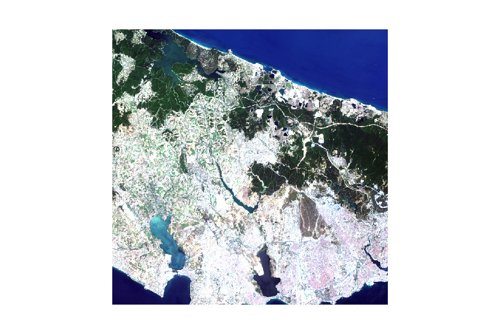

# GEO468E - Special Topics in Remote Sensing Lecture Project

## Aim Of The Project

- Nowadays, one of the biggest problems in the world is the uncontrolled destruction of green areas. If we are not careful, it is inevitable that we will see more of this problem in the future.

- Therefore, in this project, the change of vegetation cover in cities, which is one of the many application areas of remote sensing, has been studied in a simple way.

- For this purpose, ssing the satellite images of Istanbul in 2020 and 2017, an analysis was made for the European continent of Istanbul.

## Datasets

You can find the datasets used for this project from these links: ["USGS: United States Geological Survey (Study Area's Path: 180, Row: 31)"](https://earthexplorer.usgs.gov/)

## Satellite Images of The Study Area

8 July 2020

3 May 2017

