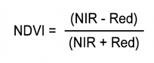
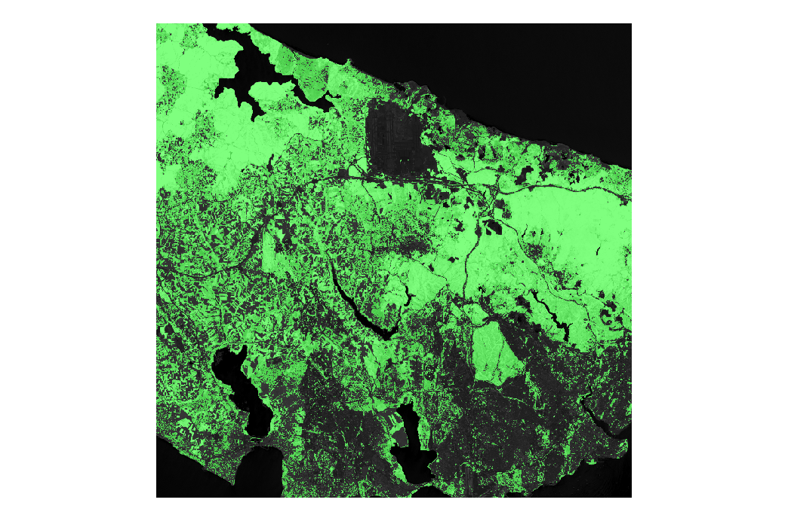
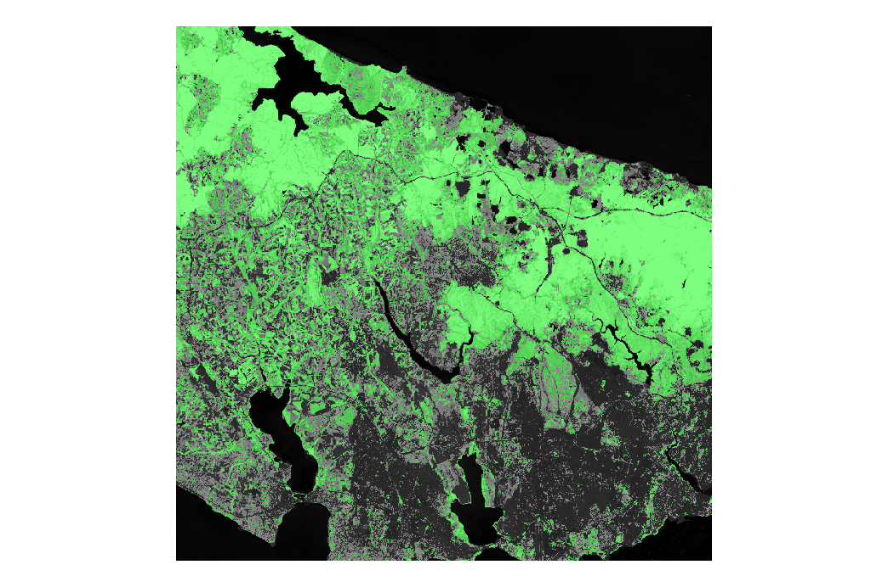
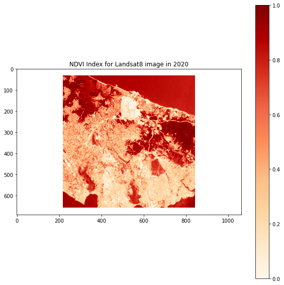
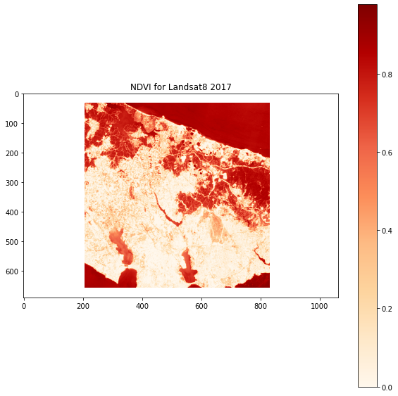
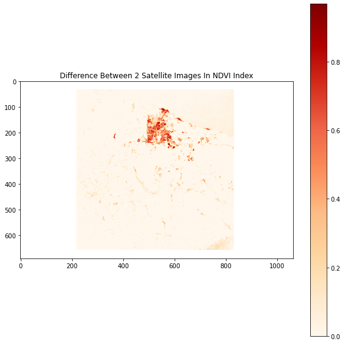

# GEO468E - Special Topics in Remote Sensing Lecture Project

## Aim Of The Project

- Nowadays, one of the biggest problems in the world is the uncontrolled destruction of green areas. If we are not careful, it is inevitable that we will see more of this problem in the future.

- Therefore, in this project, the change of vegetation cover in cities, which is one of the many application areas of remote sensing, has been studied in a simple way.

- For this purpose, ssing the satellite images of Istanbul in 2020 and 2017, an analysis was made for the European continent of Istanbul.

## Datasets

You can find the datasets used for this project from these links: ["USGS: United States Geological Survey (Study Area's Path: 180, Row: 31)"](https://earthexplorer.usgs.gov/)

## Satellite Images of The Study Area

First Satellite Image: 8 July 2020

Second Satellite Image: 3 May 2017

## Calculation of NDVI

The normalized difference vegetation index (NDVI) is used to assess the state of vegetation. In living plants chlorophyll-A, from the photosynthetic machinery, strongly absorbs red color; on the other hand, near-infrared light is strongly reflected. Live, healthy vegetation reflects around 8% of red light and 50% of near-infrared light. Dead, unhealthy, or sparse vegetation reflects approximately 30% of red light and 40% of near-infrared light.

The NDVI is calculated as:

where:

λNIR is near-infrared Band 5 and λred is color red Band 4

By its formulation, NDVI ranges from -1 to +1. In practice, an area of an image containing living vegetation will have NDVI in the range 0.3 to 0.8. High water content clouds and snow will have negative values of the index. Bodies of water, having low reflectance in both Band 4 and 5, exhibit very low positive or negative index. Soil, having slightly higher reflectance in near-infrared than in red, will produce low positive values of the index.

## NDVI Images Created From SNAP

First NDVI Image: 8 July 2020

Second NDVI Image: 3 May 2017

## NDVI Images Created From Jupyter Notebook

First NDVI Image: 8 July 2020

Second NDVI Image: 3 May 2017

## Difference Between NDVI Images

In this calculation, the image of 2020 was extracted from the 2017 image.

